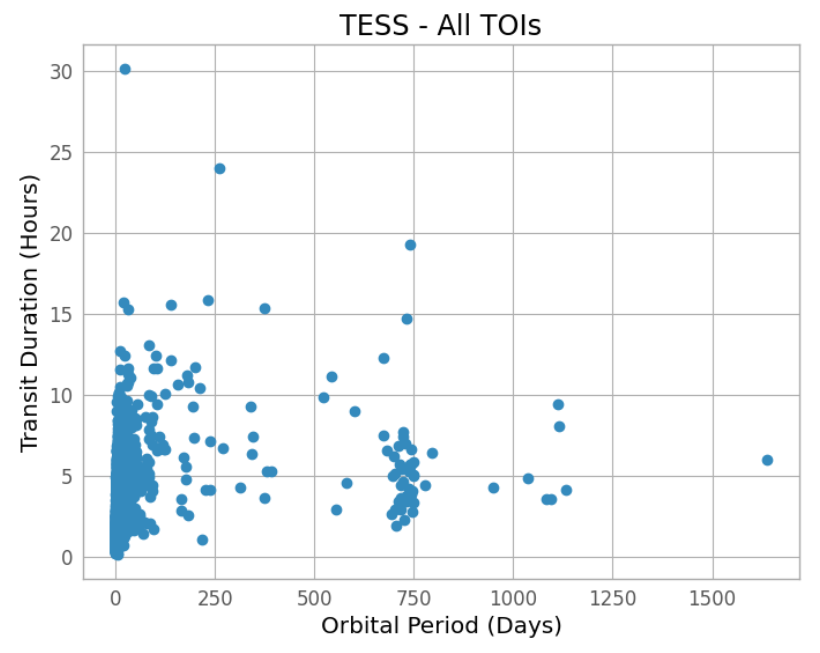

# exo-finder  -  TESS Exoplanet Analysis
Version 2.1.0 (June 2023)  
Exoplanet analysis code for TESS data

#### Background:
This tool kit is designed for analysis of exoplanets discovered with transit photometry by NASA's Transiting Exoplanet Survey Satellite ([TESS](https://tess.mit.edu/)). TESS has so far discovered around 6000 transiting exoplanets, the majority of which have short orbital periods of under 15 days. TESS, however, has a weakness with respect to longer period planets due to the fact that it only surveys a specific sector of the sky for 27.4 days at a time before moving on. This means that planets with periods longer than around 14 days could potentially be seen transiting only once in a sector, and not seen again until hundreds of days later when TESS returns to that part of the sky. This results in a planet with transits which appear to be hundreds of days apart, resulting in a long reported orbital period. Such planets, with periods nearer to that of Earth's 365 days, are interesting because of their potential to host moons or rings, and due to their relative rarity in the TESS dataset. Long period planets are of course more difficult to observe due to transiting so infrequently, and so the goal of the tools presented in the exo-finder code is to accurately pin down long period planets in the TESS data.

The main way to do this is rule out the scenario described above in which the TESS satellite only collected enough data to see two widely seperated transits of a planet, and missed the transits that happened while collecting data elsewhere. For example, if a transit on a star is seen once, and then again 800 days later, but there is very little data in the time between those transits, then it is extremely unsafe to assume the period is actually 800 days. It could be one half, at 400 days, or one fourth at 200 days, or theoretically all the way down to one fiftieth of 800 at 16 days because this is still long enough to potentially be missed by TESS in a single sector. So, this code allows analysis of fractional parts of long period TESS candidates with the goal of ruling out these cases and confirming long period planets in the data. 

One factor, however, is that the majority of the apparently long period planets in the TESS data are very likely not long period due to their transit durations. Generally, a longer period planet will have a longer transit duration, and as seen on the graph below, there are many TESS candidates that have suspiciously short durations for their reported orbital periods.

The large clump of TOIs around 750 day periods is the main region in which it is fairly certain that the planets do not actually have such long periods. The transit durations are relatively short, and the cluster is not an underlying astrophysical phenomenon, it is simply an effect of the way TESS scans the sky. So, constraining the periods of these planets is the main goal of the code in this project. 

#### Requirements:
* Python environment with 'finder_code.py' and 'finder_exec.py' from this repo, and supporting packages.
  - Requires: astropy, numpy, pandas, matplotlib, reportlab, lightkurve. Use 'pip install *package name*'.
* Internet connection for some functions.
  - If it uses lightkurve, which pulls from online data portal.
* TESS exoplanet database csv.
  - Download from this repo, or get latest release from the [source](https://tev.mit.edu/data/collection/193/).

#### Starting:
* Open a terminal and run 'python finder_exec.py' from the folder containing code files and data file.
  - Further direction on specific use of functions is given at runtime and below

#### Usage: 
Once the program has been started by running the 'finder_exec.py' file, there are a variety of commands available. Each can be executed by typing the word listed in the help list which shows at startup, or after typing 'help'. There are two main uses for the commands, either planning when to observe an exoplanet transit from the ground, or using TESS data to analyze light curves from a specific exoplanet. 
* __'info'__ command shows basic information from the TESS database on a given TOI.
  - Simply type 'info' then enter the TOI ID, for example '2090.01', to see information.
* __'predictor'__ command starts the transit predictor. This tool requires the most user input as observing location and target information must be inputted manually.
  - Defaulting the predictor will produce an example set of transits.
  - Following prompts to set parameters should be self-explanatory.
  - This program produces result files in the working directory.
* __'plotter'__ command is helpful for visualizing a specific transit to be observed. The TOI ID and ingress time in JD must be input to generate a graph showing the altitudes of the target star, the Sun, and the Moon, around the observing time.
  - Grey bar on graph indicates the predicted duration of the transit.
  - Generates png image of plot in working directory.
* __'curves'__ command retrieves all the light curves from the TESS mission for a specified TOI. This uses the lightkurve package to retrieve data.
  - A pdf showing the available data for the given TOI is created in the working directory.
  - This function also takes a fraction parameter to aid with analysis.
* __'analyze'__ retrieves light curves for a given TOI and fraction, and preforms an analysis using some basic statistics and modelling to try and identify transits.
  - Generates output pdf showing analyzed light curves including transits at the given period of the TOI and fractional period curves which were identified as possible transits.
  - The analysis and identification of transits is prone to errors, especially when the underlying data isn't very clean.
  - Output pdf contains a dataframe that shows every single analyzed light curve, and the results of the analysis algorithm for that curve.
 
#### Notes: 
* There is a hidden command 'analysis' which preforms 'analyze' on all the long period planets in the dataset it can find, but it is not recommended to run this unless you have a very good computer, or hours to wait. Many pdfs will be generated in the working directory, but keep in mind that sometimes analyzing a single planet that happens to have a lot of data can take upwards of half an hour. 

